# OpenGVL: Benchmarking Visual Temporal Progress for Data Curation
[](https://opensource.org/licenses/MIT)
[](https://github.com/budzianowski/opengvl)
[]((https://arxiv.org/html/2509.17321v1))

<p align="center">
  
</p>

<div align="center">
  <a href="#quick-start">🚀 Quick Start</a> •
  <a href="#getting-started">🧰 Getting Started</a> •
  <a href="#configuration-hydra">⚙️ Configuration</a> •
  <a href="#extending-opengvl">🧩 Extending</a> •
  <a href="#evaluation">📊 Evaluation</a>
</div>

---

- [OpenGVL: Open Generative Value Learning](#opengvl-open-generative-value-learning)
  - [About](#about)
    - [Why OpenGVL?](#why-opengvl)
    - [How it works (high level)](#how-it-works-high-level)
    - [Key Features](#key-features)
    - [Supported Models and Data Sources](#supported-models-and-data-sources)
    - [Architecture Overview](#architecture-overview)
  - [Quick Start](#quick-start)
  - [Getting Started](#getting-started)
    - [Prerequisites](#prerequisites)
    - [Installation](#installation)
    - [Environment Variables](#environment-variables)
  - [VLM Input, Output, and Few-Shot Learning](#vlm-input-output-and-few-shot-learning)
  - [Running with Apptainer/Singularity](#running-with-apptainersingularity)
  - [Configuration (Hydra)](#configuration-hydra)
  - [Extending OpenGVL](#extending-opengvl)
    - [Adding a New Model](#adding-a-new-model)
    - [Adding a New Dataset](#adding-a-new-dataset)
    - [Modifying Prompts (Templates and Phrases)](#modifying-prompts-templates-and-phrases)
  - [Known Issues \& Troubleshooting](#known-issues--troubleshooting)
  - [Contributing](#contributing)
  - [Citation](#citation)
  - [Acknowledgments](#acknowledgments)
  - [License](#license)

---

## About

OpenGVL provides a benchmark and toolkit to evaluate how well vision-language models (VLMs) understand temporal progress in robotic tasks. It enables automatic annotation and curation of large-scale robotics datasets by predicting task completion from video frames, making it practical for data quality assessment and filtering.

OpenGVL exposes a simple, unified interface across VLMs and data sources, making it a solid foundation for research and practical deployments of Generative Value Learning in robotics and related domains.

### Why OpenGVL?
- Evaluate temporal understanding of VLMs with a principled metric (Value-Order Correlation, VOC).
- Curate datasets at scale by estimating per-frame task completion.
- Standardize prompts, images, and outputs across multiple models and datasets.

### How it works (high level)
1. Load evaluation episodes (shuffled frames) and optional context episodes (ordered, with known progress).
2. Build a prompt with few-shot examples.
3. Query a chosen VLM with images + prompt.
4. Parse the VLM’s textual outputs into per-frame completion percentages.
5. Compute VOC/metrics against ground truth and save results.


### Architecture Overview

```mermaid
flowchart TB
  %% Enhanced OpenGVL pipeline with improved UX
  subgraph S0["⚙️ Configuration Layer"]
    direction LR
    C1{{"🔧 Hydra Config<br/>• Models & Prompts<br/>• Datasets & Loaders<br/>• Experiment Settings"}}
  end
  
  subgraph S1["📊 Data Preparation"]
    direction TB
    D1[("📹 Evaluation Episode<br/>(Shuffled Frames)")]
    D2[("🎬 Context Episodes<br/>(Ordered, Known %)")]
    D1 -.-> D2
  end
  
  subgraph S2["🤖 AI Processing Pipeline"]
    direction TB
    I1["✍️ Prompt Composition<br/>Template + Phrases + Instructions"]
    I2["🖼️ Frame Attachment<br/>Evaluation + Context Frames"]
    I3{{"🧠 VLM API Gateway<br/>Gemini • GPT-4 • Gemma • Kimi"}}
    I1 --> I2 --> I3
  end
  
  subgraph S3["📈 Analytics & Output"]
    direction TB
    E1["🔍 Frame Completion Parsing<br/>Per-frame % Analysis"]
    E2["📏 VOC Computation<br/>Temporal Order Correlation"]
    E3[("💾 Export Results<br/>predictions.jsonl • logs • plots")]
    E1 --> E2 --> E3
  end
  
  %% External Dependencies
  K1{{🔐 Environment Keys<br/>.env API Configuration}}
  K2{{🐳 Containerization<br/>Apptainer/Singularity}}
  K3{{💽 Data Sources<br/>Local Cache • HF Datasets}}
  
  %% Main flow connections
  C1 ==> D1
  C1 -.-> D2
  D1 ==> I1
  D2 -.-> I1
  I3 ==> E1
  
  %% External connections
  K1 -.-> I3
  K2 -.-> S2
  K3 -.-> D1
  
  %% Enhanced styling
  style S0 fill:#1e3a8a,stroke:#1d4ed8,color:#ffffff,stroke-width:3px,rx:15
  style S1 fill:#065f46,stroke:#047857,color:#ffffff,stroke-width:3px,rx:15
  style S2 fill:#581c87,stroke:#7c3aed,color:#ffffff,stroke-width:3px,rx:15
  style S3 fill:#dc2626,stroke:#ef4444,color:#ffffff,stroke-width:3px,rx:15
  
  %% Node styling
  style C1 fill:#3b82f6,stroke:#2563eb,color:#ffffff,stroke-width:2px
  style D1 fill:#10b981,stroke:#059669,color:#ffffff,stroke-width:2px
  style D2 fill:#6ee7b7,stroke:#34d399,color:#111827,stroke-width:2px
  style I1 fill:#a855f7,stroke:#9333ea,color:#ffffff,stroke-width:2px
  style I2 fill:#c084fc,stroke:#a855f7,color:#ffffff,stroke-width:2px
  style I3 fill:#7c3aed,stroke:#6d28d9,color:#ffffff,stroke-width:2px
  style E1 fill:#f97316,stroke:#ea580c,color:#ffffff,stroke-width:2px
  style E2 fill:#fb923c,stroke:#f97316,color:#ffffff,stroke-width:2px
  style E3 fill:#fbbf24,stroke:#f59e0b,color:#111827,stroke-width:2px
  
  %% External dependency styling
  classDef external fill:#f8fafc,stroke:#64748b,color:#475569,stroke-width:2px,stroke-dasharray:8 4
  class K1,K2,K3 external
```



---

## Quick Start

After setup (see Getting Started), run a prediction using the experiment config at `configs/experiments/predict.yaml`:

```bash
HYDRA_FULL_ERROR=1 PYTHONPATH=. uv run python3 -m opengvl.scripts.predict \
  --config-dir configs/experiments \
  --config-name predict
```

Results are saved under `outputs/DATE_TIME/` with predictions, raw outputs, and metrics.

Tip: you can override any config at the CLI, e.g. `model.temperature=0.5`.

---

## Getting Started

### Prerequisites
- Python 3.11+
- [uv](https://github.com/astral-sh/uv) (recommended) or pip for package management

### Installation
1. Clone the repository:
   ```bash
   git clone https://github.com/budzianowski/opengvl.git
   cd opengvl
   ```

2.  set up a virtual environment:
    ```bash
    PYTHONPATH=. uv run python3 -c "print('all packages installed')" # in root of repository
    ```

### Environment Variables
Create a `.env` file in the project root:
```bash
cp .env.example .env
```
Then edit `.env` with your credentials:
```
OPENAI_API_KEY="your-openai-api-key"
GOOGLE_API_KEY="your-google-api-key"
HUGGING_FACE_HUB_TOKEN="your-hugging-face-token"
```

---

## VLM Input, Output, and Few-Shot Learning

Each prediction uses:
1) A prompt constructed from a template (e.g., `configs/prompts/concise.yaml`) plus dataset-specific instructions.
   Example instruction: “Task: Pick up the blue block and place it in the red bowl. Estimate task completion (0–100%) per frame. Frames can be shuffled.”
2) A set of images:
   - Evaluation episode: shuffled frames to estimate completion.
   - Optional context episodes: complete, ordered episodes with known percentages for few-shot guidance.

The VLM returns a text response with per-frame percentages. `extract_percentages()` in `opengvl/utils/inference.py` parses the string into a list of integers, e.g., “Frame 1: 50%, Frame 2: 100%, Frame 3: 25%” → `[50, 100, 25]`.

---

## Running with Apptainer/Singularity

For reproducible, portable runs:

Prerequisites:
- [Apptainer](https://apptainer.org/docs/user/main/installation.html)
- NVIDIA drivers on the host for GPU support (for locally inferred models)

Build the image:
```bash
apptainer build opengvl.sif apptainer/opengvl.def
```

Run the quick start prediction with GPU:
```bash
apptainer run --nv opengvl.sif python -m opengvl.scripts.predict \
  --config-dir configs/experiments \
  --config-name predict
```

Tip: pass environment via `--env` flags or export them in your shell prior to `apptainer run`.

---

## Configuration (Hydra)

Configuration lives in `configs/`:
- `configs/model/`: model configs (e.g., `gemini.yaml`, `gemma.yaml`, `openai.yaml`)
- `configs/dataset/`: dataset configs
- `configs/data_loader/`: data loader configs (e.g., `huggingface.yaml`, `local.yaml`)
- `configs/prompts/`: prompt styles
- `configs/experiments/`: complete experiment presets (e.g., `predict.yaml`)

Override parameters from the command line. Examples:
```bash
# Run with explicit experiment config
PYTHONPATH=. uv run python3 -m opengvl.scripts.predict --config-dir configs/experiments --config-name predict

# Override individual fields
PYTHONPATH=. uv run python3 -m opengvl.scripts.predict --config-dir configs/experiments --config-name predict \
  model=gemini dataset=berkeleymvp data_loader=huggingface model.temperature=0.5
```

---

## Extending OpenGVL

### Adding a New Model

OpenGVL clients inherit from `opengvl.clients.base.BaseModelClient`. You only need to implement `_generate_from_events(self, events: list[Event]) -> str`, which receives a provider-agnostic sequence of text/image events already assembled by the framework. See `opengvl/clients/gemini.py` for a complete reference implementation.

1) Implement a client in `opengvl/clients/my_model.py`:

```python
# opengvl/clients/my_model.py (concise example)
import os
from typing import cast, List

from loguru import logger

from opengvl.clients.base import BaseModelClient
from opengvl.utils.aliases import Event, ImageEvent, ImageT, TextEvent
from opengvl.utils.images import encode_image


class MyModelClient(BaseModelClient):
  def __init__(self, *, rpm: float = 0.0, model_name: str):
    super().__init__(rpm=rpm)
    if not os.getenv("MY_MODEL_API_KEY"):
      raise OSError("Missing MY_MODEL_API_KEY")
    self.model_name = model_name
    logger.info(f"Using MyModel '{self.model_name}'")

  def _generate_from_events(self, events: List[Event]) -> str:
    parts: List[bytes | str] = []
    for ev in events:
      if isinstance(ev, TextEvent):
        parts.append(ev.text)
      elif isinstance(ev, ImageEvent):
        parts.append(encode_image(cast(ImageT, ev.image)))

    # Call your provider with `parts` and return the provider's text response.
    # Placeholder response for docs/tests:
    return "Frame 1: Task Completion: 50%\nFrame 2: Task Completion: 100%"
```

2) Add a Hydra config at `configs/model/my_model.yaml`:

```yaml
_target_: opengvl.clients.my_model.MyModelClient
model_name: my-model-name
rpm: 15  # requests per minute (rate limiter)
```

3) Use your model via CLI or experiment config:

```bash
PYTHONPATH=. uv run python3 -m opengvl.scripts.predict \
  --config-dir configs/experiments \
  --config-name predict \
  model=my_model
```
---

### Adding a New Dataset

Create a dataset config that matches the keys used by our HuggingFace loader (`configs/data_loader/huggingface.yaml`). Example:

```yaml
# configs/dataset/my_dataset.yaml
name: my_dataset
dataset_name: "org-or-user/my_dataset_on_hub"
camera_index: 0
max_episodes: 100
num_frames: 15
num_context_episodes: 2
```

Then choose a loader (e.g., Hugging Face) in your experiment or via CLI:

```bash
PYTHONPATH=. uv run python3 -m opengvl.scripts.predict \
  --config-dir configs/experiments \
  --config-name predict \
  dataset=my_dataset data_loader=huggingface
```

---

### Modifying Prompts (Templates and Phrases)

Prompts are split into two layers:
- A high-level prompt `template` (under `configs/prompts/`) with free-form text.
- Structured `prompt_phrases` (under `configs/prompt_phrases/`) with required keys validated by the code.

1) Create a new prompt template file:

```yaml
# configs/prompts/my_prompt.yaml
template: |
  You are an expert roboticist. Predict task completion percentages for the task: {instruction}.
  Percentages are in [0, 100], where 100 is full completion. Frames may be shuffled.
  For each frame that does NOT already have a completion percentage provided,
  output strictly: "Frame {{i}}: Task Completion: {{p}}%".
  Be precise and consistent; do not include extra text.
```

2) (Optional) Create a custom phrase set. The keys must match `PromptPhraseKey` in `opengvl/utils/constants.py`:

```yaml
# configs/prompt_phrases/my_style.yaml
initial_scene_label: "Initial robot scene:"
initial_scene_completion: "In the initial robot scene, the task completion percentage is 0%."
context_frame_label_template: "Frame {i}:"
context_frame_completion_template: "Task Completion: {p}%"
eval_frame_label_template: "Frame {i}:"
eval_task_completion_instruction:
  - "Now, for the task of {instruction}, output the task completion percentage for the following frames that are presented in random order. For each frame, format your response as follows: Frame {{i}}: Task Completion: {{p}}%"
  - "Be rigorous and precise; percentage reflects task completion."
  - "Remember: frames are in random order."
```

3) Use your custom prompt in an experiment or from CLI:

```bash
PYTHONPATH=. uv run python3 -m opengvl.scripts.predict \
  --config-dir configs/experiments \
  --config-name predict \
  prompts=my_prompt prompt_phrases=my_style
```

Notes:
- The framework automatically numbers frames across context and evaluation. Your instructions should make it explicit that only frames without provided percentages should be predicted (see our `rigorous` prompt for a safe pattern).
- The phrase keys are required; missing/empty keys will raise a clear `ValueError` before calling the model.


---

## Known Issues & Troubleshooting

- macOS library path:
  ```bash
  export DYLD_FALLBACK_LIBRARY_PATH=/opt/homebrew/lib
  ```
- GPU OOM (CUDA): reduce `batch_size` or image resolution in the model config (e.g., `configs/model/gemini.yaml`).
- Hugging Face authentication: ensure `HUGGING_FACE_HUB_TOKEN` is set in `.env` for gated models/private datasets.
- API rate limits: consider lowering concurrency or increasing `TQDM_MININTERVAL` when applicable.

---

## Contributing

Contributions are welcome!
- Report bugs or request features via GitHub issues.
- Open pull requests for fixes and enhancements.
- For substantial changes, please discuss via an issue first and keep PRs focused and well-tested.

Suggested checklist:
- Add/update tests for new functionality.
- Include/adjust configs under `configs/` as needed.
- Update documentation and examples where relevant.

---

## Citation

If you use OpenGVL in your research, please cite:

```bibtex
@misc{budzianowski2025opengvlbenchmarkingvisual,
      title={OpenGVL - Benchmarking Visual Temporal Progress for Data Curation}, 
      author={Paweł Budzianowski and Emilia Wiśnios and Gracjan Góral and Igor Kulakov and Viktor Petrenko and Krzysztof Walas},
      year={2025},
      eprint={2509.17321},
      archivePrefix={arXiv},
      primaryClass={cs.RO},
      url={https://arxiv.org/abs/2509.17321}, 
}
```

---

## Acknowledgments

We thank the broader open-source community and prior work that inspired OpenGVL:
- Foundational research on Generative Value Learning ([OpenGVL paper](https://arxiv.org/abs/2411.04549))
- [LeRobot](https://huggingface.co/lerobot) for dataset infrastructure
- [Hydra](https://hydra.cc/) for configuration management
- [Hugging Face](https://huggingface.co/) for dataset hosting/model access

---

## License

This project is licensed under the MIT License. See [LICENSE](LICENSE) for details.
