# OpenGVL: Open Generative Value Learning

[](https://badge.fury.io/py/gvl)
[](https://opensource.org/licenses/MIT)
[](https://github.com/budzianowski/opengvl)
[](https://arxiv.org/abs/2411.04549)

An open-source implementation of Generative Value Learning for robotics and beyond.

<!-- Header Banner (4x2 grid as a single image). Replace with your exported banner image. -->
<p align="center">
  
</p>

`#message to copilot: add here smething like this below but make if nicer `
```
<table>
  <tr>
    <td align="center"><a href="#quick-start">Quick Start</a></td>
    <td align="center"><a href="#getting-started">Getting Started</a></td>
    <td align="center"><a href="#extending-opengvl">Extending OpenGVL</a></td>
    <td align="center"><a href="#evaluation">Evaluation</a></td>
  </tr>
</table>

```


---

- [OpenGVL: Open Generative Value Learning](#opengvl-open-generative-value-learning)
  - [About](#about)
    - [Why OpenGVL?](#why-opengvl)
    - [How it works (high level)](#how-it-works-high-level)
    - [Key Features](#key-features)
    - [Supported Models and Data Sources](#supported-models-and-data-sources)
    - [Architecture Overview](#architecture-overview)
  - [Quick Start](#quick-start)
  - [Getting Started](#getting-started)
    - [Prerequisites](#prerequisites)
    - [Installation](#installation)
    - [Environment Variables](#environment-variables)
  - [VLM Input, Output, and Few-Shot Learning](#vlm-input-output-and-few-shot-learning)
  - [Running with Apptainer/Singularity](#running-with-apptainersingularity)
  - [Configuration (Hydra)](#configuration-hydra)
  - [Extending OpenGVL](#extending-opengvl)
    - [Adding a New Model](#adding-a-new-model)
    - [Adding a New Dataset](#adding-a-new-dataset)
  - [Repository Structure](#repository-structure)
  - [Known Issues \& Troubleshooting](#known-issues--troubleshooting)
  - [Contributing](#contributing)
  - [Citation](#citation)
  - [Acknowledgments](#acknowledgments)
  - [License](#license)

---

## About

OpenGVL provides a benchmark and toolkit to evaluate how well vision-language models (VLMs) understand temporal progress in robotic tasks. It enables automatic annotation and curation of large-scale robotics datasets by predicting task completion from video frames, making it practical for data quality assessment and filtering.

OpenGVL exposes a simple, unified interface across VLMs and data sources, making it a solid foundation for research and practical deployments of Generative Value Learning in robotics and related domains.

### Why OpenGVL?
- Evaluate temporal understanding of VLMs with a principled metrics (Value-Order Correlation, VOC).
- Curate datasets at scale by estimating per-frame task completion.
- Standardize prompts, images, and outputs across multiple models and datasets.

### How it works (high level)
1. Load evaluation episodes (shuffled frames) and optional context episodes (ordered, with known progress).
2. Build a prompt with few-shot examples.
3. Query a chosen VLM with images + prompt.
4. Parse the VLM’s textual outputs into per-frame completion percentages.
5. Compute VOC/metrics against ground truth and save results.

### Key Features
- Modular design: swap models, datasets, prompts, and loaders with minimal changes.
- Extensible: add new VLM clients and datasets via lightweight adapter classes.
- Configuration-driven: powered by Hydra for reproducible, override-friendly experiments.
- Multi-VLM support: out-of-the-box clients for Gemini, Gemma, Kimi, and OpenAI GPT models.
- Reproducible runs: containerized execution via Apptainer/Singularity.

### Supported Models and Data Sources
- Models: Gemini, Gemma, Kimi, OpenAI GPT series
- Data sources: Hugging Face Hub datasets and local folders
- Prompts: configurable prompt templates for concise or detailed instructions

### Architecture Overview
`MESSage to copilot: ok it is nice but make it more readable, it should have better structure because now it is like a loooong pipe`

```mermaid
flowchart LR
  %% High-level, fancy overview of the OpenGVL pipeline

  %% Stages
  subgraph S0["🔧 User Config (Hydra)"]
    C1["models • prompts • datasets • loaders • experiments"]
  end

  subgraph S1["🗂️ Data & Context"]
    D1["Load evaluation episodes (frames)"]
    D2["Optional few-shot context (ordered)"]
  end

  subgraph S2["🧠 VLM Inference"]
    I1["Compose prompt + attach frames"]
    I2["VLM API (Gemini • GPT • Gemma • Kimi)"]
  end

  subgraph S3["📈 Scoring & Reporting"]
    E1["Parse completion % per frame"]
    E2["VOC (temporal order correlation)"]
    E3["Results & Artifacts (jsonl • plots • logs)"]
  end

  %% Flow
  C1 --> D1
  C1 -. config hints .-> D2
  D1 --> I1
  D2 --> I1
  I1 --> I2
  I2 --> E1
  E1 --> E2
  E2 --> E3

  %% Optional/Infra
  K1([🔑 .env API keys]) -.-> I2
  K2([📦 Apptainer/Singularity]) -. reproducible runs .-> I2
  K3([💾 Cache/Local data]) -.-> D1

  %% Styles
  style S0 fill:#0ea5e9,stroke:#0284c7,stroke-width:2px,color:#ffffff
  style S1 fill:#10b981,stroke:#059669,stroke-width:2px,color:#ffffff
  style S2 fill:#8b5cf6,stroke:#7c3aed,stroke-width:2px,color:#ffffff
  style S3 fill:#f59e0b,stroke:#d97706,stroke-width:2px,color:#111827

  classDef optional fill:#f3f4f6,stroke:#9ca3af,stroke-dasharray: 5 5,color:#111827
  class K1,K2,K3 optional
```


---

## Quick Start

After setup (see Getting Started), run a prediction from the [config file](configs/experiments/predict.yaml)

```bash
 HYDRA_FULL_ERROR=1 PYTHONPATH=. uv run python3 -m opengvl.scripts.predict --config-dir configs/experiments --config-name predict
```

Results are saved under `outputs/DATE_TIME/` with predictions, raw outputs, and metrics.

---

## Getting Started

### Prerequisites
- Python 3.11+
- [uv](https://github.com/astral-sh/uv) (recommended) or pip for package management

### Installation
1. Clone the repository:
   ```bash
   git clone https://github.com/budzianowski/opengvl.git
   cd opengvl
   ```

2.  set up a virtual environment:
   Using `uv`:
    ```bash
    PYTHONPATH=. uv run python3 -c "print('all packages installed')" # in root of repository
    ```
    Or using `venv`:
    ```bash
    python -m venv .venv
    source .venv/bin/activate
    ```


### Environment Variables
Create a `.env` file in the project root `cp .env.example .env` then edit with your credentials.

## VLM Input, Output, and Few-Shot Learning

Each prediction uses:
1) A prompt constructed from a template (e.g., `configs/prompts/concise.yaml`) plus dataset-specific instructions.  
   Example instruction: “Task: Pick up the blue block and place it in the red bowl. Estimate task completion (0–100%) per frame. Frames can be shuffled.”
2) A set of images:
   - Evaluation episode: shuffled frames to estimate completion.
   - Optional context episodes: complete, ordered episodes with known percentages for few-shot guidance.

The VLM returns a text response with per-frame percentages. `extract_percentages()` in `opengvl/utils/inference.py` parses the string into a list of integers, e.g., “Frame 1: 50%, Frame 2: 100%, Frame 3: 25%” → `[50, 100, 25]`.


## Running with Apptainer/Singularity

For reproducible, portable runs:

Prerequisites:
- [Apptainer](https://apptainer.org/docs/user/main/installation.html)
- NVIDIA drivers on the host for GPU support (for locally inferred models)

Build the image:
```bash
apptainer build opengvl.sif apptainer/opengvl.def
```

Run the quick start prediction with GPU:
```bash
export GEM
export HUGGING_FACE_HUB_TOKEN="your-token"

apptainer run --nv opengvl.sif python opengvl/scripts/predict.py \
  model=gemini \
  dataset=berkeleymvp \
  data_loader=huggingface
```

Tip: pass environment via `--env` flags or export them in your shell prior to `apptainer run`.

---

## Configuration (Hydra)

Configuration lives in `configs/`:
- `configs/model/`: model configs (e.g., `gemini.yaml`, `gemma.yaml`, `openai.yaml`)
- `configs/dataset/`: dataset configs
- `configs/data_loader/`: data loader configs (e.g., `huggingface.yaml`, `local.yaml`)
- `configs/prompts/`: prompt styles
- `configs/experiments/`: complete experiment presets

Override parameters from the command line. Example:
```bash
# message to copilot - this must be upgraded see how to config look like
python opengvl/scripts/predict.py \
  model=gemini dataset=berkeleymvp data_loader=huggingface \
  model.temperature=0.5
```

---

## Extending OpenGVL

### Adding a New Model
1. Implement a client under `opengvl/clients/` inheriting from `opengvl.clients.base.BaseClient` and implement `predict()`:
   ```python
   # opengvl/clients/my_model.py
   from .base import BaseClient

   class MyModelClient(BaseClient):
       def __init__(self, model_name: str, **kwargs):
           super().__init__(model_name, **kwargs)
           # Initialization logic

       def predict(self, messages, **kwargs):
           # Prediction logic
           return "Frame 1: 50%, Frame 2: 100%"
   ```
2. Add a config in `configs/model/my_model.yaml`:
   ```yaml
   _target_: opengvl.clients.my_model.MyModelClient
   model_name: "my-model-name"
   ```
3. Run:
   ```bash
   python opengvl/scripts/predict.py model=my_model ...
   ```

### Adding a New Dataset
1. Add a config in `configs/dataset/my_dataset.yaml`:
   ```yaml
   name: "my-dataset-name"
   split: "test"
   # Additional parameters
   ```
2. Choose a loader (`huggingface`, `local`, or your own).
3. Run:
   ```bash
   python opengvl/scripts/predict.py dataset=my_dataset ...
   ```

---

## Repository Structure

```
.
├── apptainer/        # Apptainer/Singularity definition for containerization
├── configs/          # Hydra configuration files
│   ├── data_loader/
│   ├── dataset/
│   ├── model/
│   ├── prompts/
│   └── experiments/
├── notebooks/        # Jupyter notebooks for analysis and inference
├── opengvl/          # Main Python package
│   ├── clients/        # VLM clients (Gemini, OpenAI, etc.)
│   ├── data_loaders/   # Data loaders (HuggingFace, local)
│   ├── metrics/        # Evaluation metrics (e.g., VOC)
│   ├── scripts/        # Entry-point scripts (e.g., predict.py)
│   └── utils/          # Utilities (e.g., parsing helpers)
├── tests/            # Tests
├── .env.example
├── pyproject.toml
└── README.md
```

---

## Known Issues & Troubleshooting

- macOS library path:
  ```bash
  export DYLD_FALLBACK_LIBRARY_PATH=/opt/homebrew/lib
  ```
- GPU OOM (CUDA): reduce `batch_size` or image resolution in the model config (e.g., `configs/model/gemini.yaml`).
- Hugging Face authentication: ensure `HUGGING_FACE_HUB_TOKEN` is set in `.env` for gated models/private datasets.
- API rate limits: consider lowering concurrency or increasing `TQDM_MININTERVAL` when applicable.

---

## Contributing

Contributions are welcome!  
- Report bugs or request features via GitHub issues.
- Open pull requests for fixes and enhancements.
- For substantial changes, please discuss via an issue first and keep PRs focused and well-tested.

Suggested checklist:
- Add/update tests for new functionality.
- Include/adjust configs under `configs/` as needed.
- Update documentation and examples where relevant.

---

## Citation

If you use OpenGVL in your research, please cite:

```bibtex
@article{opengvl2024,
  title={OpenGVL: Benchmarking Visual Temporal Progress for Data Curation},
  author={{Authors}},
  journal={arXiv preprint arXiv:2411.04549},
  year={2024}
}
```

---

## Acknowledgments

We thank the broader open-source community and prior work that inspired OpenGVL:
- Foundational research on Generative Value Learning ([OpenGVL paper](https://arxiv.org/abs/2411.04549))
- [LeRobot](https://huggingface.co/lerobot) for dataset infrastructure
- [Hydra](https://hydra.cc/) for configuration management
- [Hugging Face](https://huggingface.co/) for dataset hosting/model access

---

## License

This project is licensed under the MIT License. See [LICENSE](LICENSE) for details.